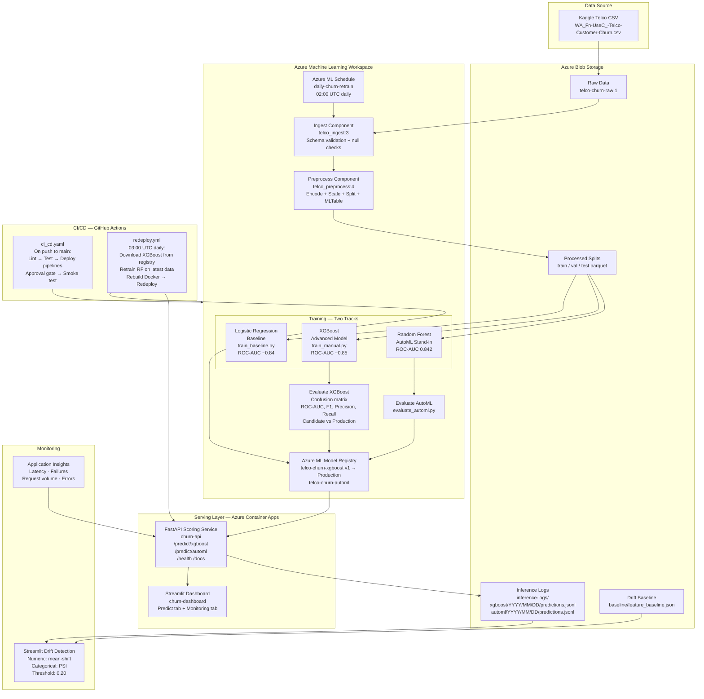
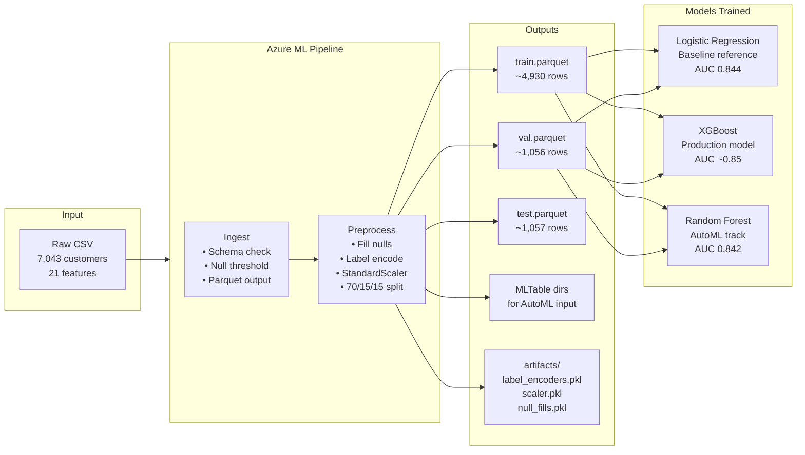
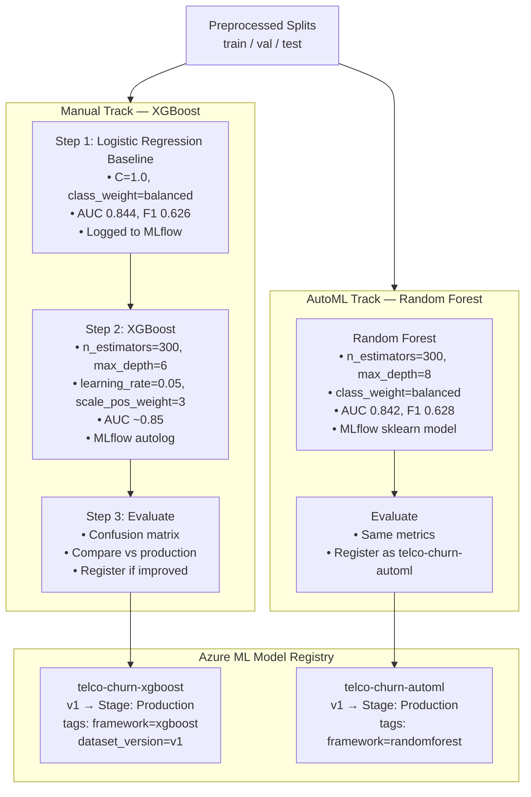
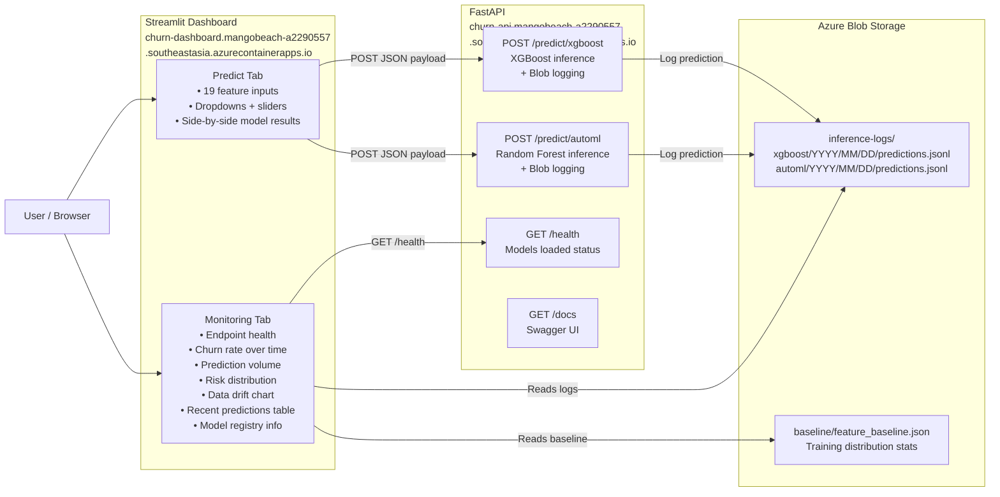
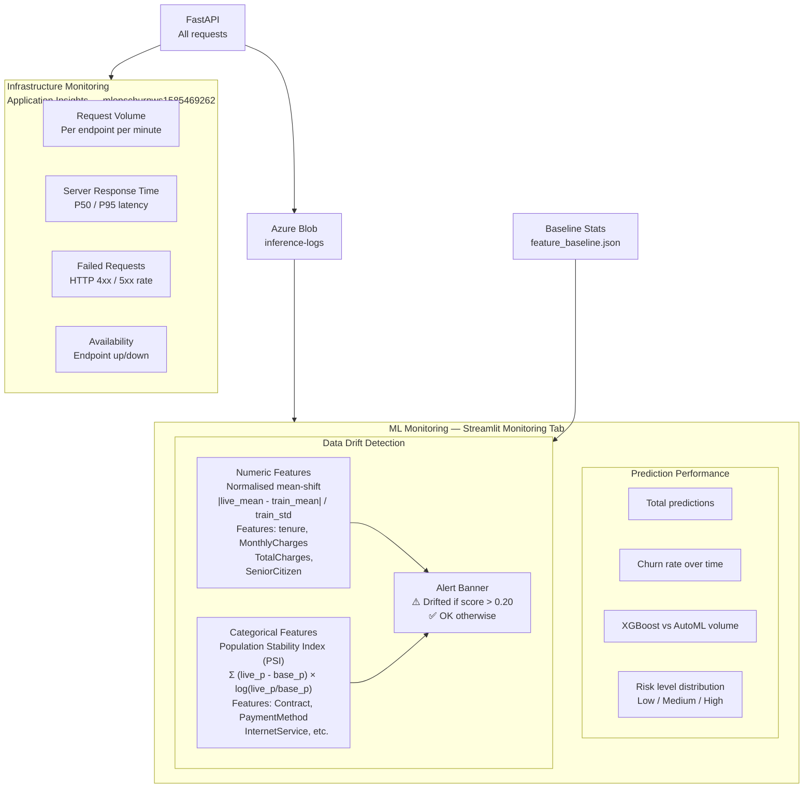
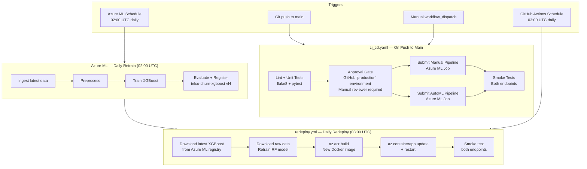

# Project Architecture — Telco Churn Prediction MLOps

## 1. End-to-End System Overview

---

## 2. Data Flow

---

## 3. Training Tracks

---

## 4. Serving Architecture

---

## 5. Monitoring Architecture

---

## 6. CI/CD & Automation Flow

---

## 7. Key Metrics Summary

| Metric | Logistic Regression | XGBoost | Random Forest (AutoML) |
|--------|--------------------|---------|-----------------------|
| Val ROC-AUC | 0.844 | ~0.850 | 0.842 |
| Val F1 | 0.626 | ~0.630 | 0.628 |
| Val Precision | 0.504 | ~0.55 | ~0.52 |
| Val Recall | 0.825 | ~0.70 | ~0.72 |
| Role | Baseline reference | Production | AutoML track |

## 8. Live URLs

| Service | URL |
|---------|-----|
| Streamlit Dashboard | https://churn-dashboard.mangobeach-a2290557.southeastasia.azurecontainerapps.io |
| FastAPI + Swagger | https://churn-api.mangobeach-a2290557.southeastasia.azurecontainerapps.io/docs |
| FastAPI Health | https://churn-api.mangobeach-a2290557.southeastasia.azurecontainerapps.io/health |
